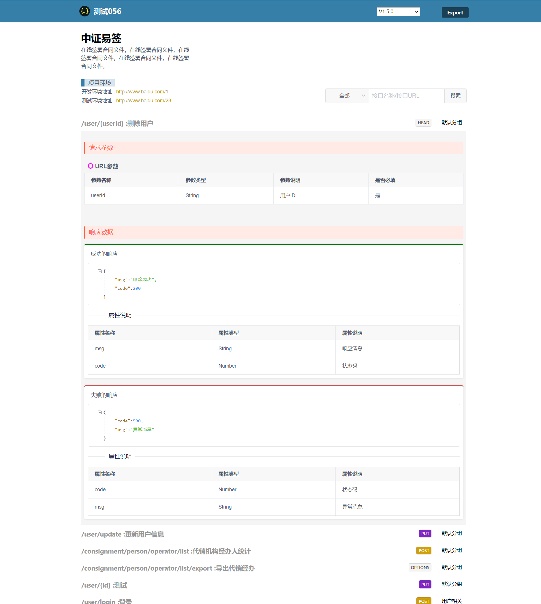

介绍

个人用springboot+vue2编写的api接口简单的管理平台，支持api录入、展示、导出、版本控制等，源码可用于学习，代码不继续维护。

项目概述

- `ycc-api-admin` 为Java服务端
- `ycc-api-manager` 为Vue2前端项目

数据存储

支持 mysql 和 h2数据库 ，默认使用h2嵌入式数据库。

默认的账号 

admin/admin

**页面展示**

项目列表

项目Api接口列表

项目Api接口编辑

试图-API列表

